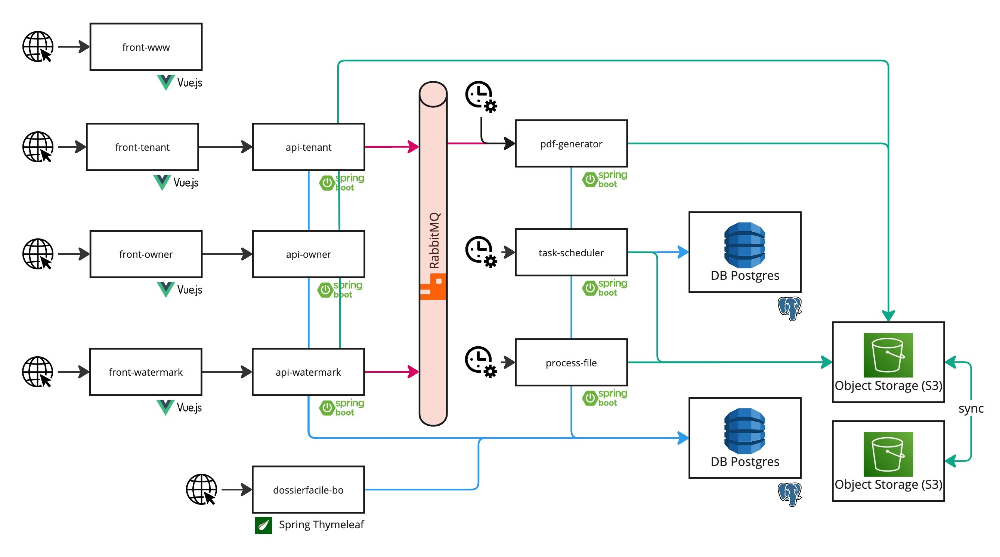

# DossierFacile Back-end

> [!NOTE]
> DossierFacile.fr a été créé par le Ministère de la Transition écologique pour aider à la réalisation de dossiers de location.

The project is available at [DossierFacile.fr](https://dossierfacile.fr).

The front-end code is also accessible in [this repository](https://github.com/MTES-MCT/Dossier-Facile-Frontend).

## Infrastructure



## Prerequisites

You need to have [JDK 21](https://openjdk.org/projects/jdk/21/), [maven](https://maven.apache.org/) and [Docker](https://docs.docker.com/engine/install/) installed.

## Docker

In this project we use a Docker Compose to setup the dev environment.
Several services are used:

- PostgreSQL => Database for all the applications
- NGINX => Reverse proxy for the BO to serve SSL
- RabbitMQ => Queue used by pdf-generator, api-tenant and api-watermark

Run:

```shell
docker-compose -f docker-compose.dev.yml up -d
```

To create a dedicated user and database for dossierfacile.

### Linux users

1. Create the file `docker-compose.overwrite.yml`
2. Add the following to it:
   ```yaml
   services:
     nginx:
       extra_hosts:
         - "host.docker.internal:host-gateway"
   ```
3. Add it to the `./.git/info/exclude` file to ignore it without modifying the shared `.gitignore`
4. Run the stack with `docker compose -f docker-compose.dev.yml -f docker-compose.overwrite.yml up -d`

You may also need to add pgcrypt extension to your local database:

1. Connect to the container database `docker exec -it <container_name_or_id> psql -U <username> -d <database_name>`
2. Run this SQL query `CREATE EXTENSION IF NOT EXISTS "pgcrypto";`

## Keycloak

Follow those steps to use [Keycloak](https://www.keycloak.org/) in dev environment locally:

1. Follow the README instructions on repo [Dossier-Facile-Keycloak](https://github.com/MTES-MCT/Dossier-Facile-Keycloak).
2. Connect to your keycloak admin console (default: http://localhost:8085/auth)
3. Create a new realm "dossier-facile"
4. Inside the realm create a new Client scope:
   - Name: dossier
   - Type: Default
   - Display on consent screen: On
   - Include in token scope: On
5. Inside the realm create a new client: "dossier-facile-frontend-localhost"
   - Root: Url of the tenant webProject (default: http://localhost:8090)
   - Home URL: Url of the tenant webProject (default: http://localhost:8090)
   - valid redirect Uris: `*`
   - Valid post logout Uris: `*`
   - web Origins: `*`
   - Client authentication: Off
   - authentication flow: Standard flow and Direct access Grants
   - Theme: df
   - Client scopes: add dossier
6. Create a new realm: "dossier-facile-owner"
7. Inside the realm create a new Client scope:
   - Name: dossier
   - Type: Default
   - Display on consent screen: On
   - Include in token scope: On
8. Inside the realm create a new client: "dossier-facile-owner-localhost"
   - Root: Url of the tenant webProject (default: http://localhost:8090)
   - Home URL: Url of the tenant webProject (default: http://localhost:8090)
   - valid redirect Uris: `*`
   - Valid post logout Uris: `*`
   - web Origins: `*`
   - Client authentication: Off
   - authentication flow: Standard flow and Direct access Grants
   - Theme: df
   - Client scopes: add dossier
9. Inside the realm Master create a new client: "dossier-facile-api"
   - Root: empty
   - Home URL: empty
   - valid redirect Uris: `*`
   - Valid post logout Uris: `*`
   - web Origins: `*`
   - Client authentication: On
   - authentication flow: Standard flow / Direct access Grants / Service account roles
10. In this client you need add a Service account roles
    - In the tab "Service Account Roles" add the role "admin"
11. Save and copy the dossier-facile-api credentials (Client Secret).

## General Config

Create a new folder `mock-storage` to store files.

### Storage Configuration

For development, use the LOCAL provider with mock storage. For production, you can use S3 (OVH Multi-AZ), OVH, or OUTSCALE providers.

Example configuration for the new S3 provider:

```properties
storage.provider.list=S3
s3.region=sbg
s3.endpoint.url=https://s3.sbg.io.cloud.ovh.net
s3.access.key=your-access-key
s3.secret.access.key=your-secret-key
```

- Project: [dossierfacile-api-owner](dossierfacile-api-owner/README.md)
- Project: [dossierfacile-api-tenant](dossierfacile-api-tenant/README.md)
- Project: [dossierfacile-api-watermark](dossierfacile-api-watermark/README.md)
- Project: [dossierfacile-bo](dossierfacile-bo/README.md)
- Project: [dossierfacile-pdf-generator](dossierfacile-pdf-generator/README.md)
- Project: [dossierfacile-process-file](dossierfacile-process-file/README.md)
- Project: [dossierfacile-task-scheduler](dossierfacile-task-scheduler/README.md)

## Feature flags (must be created through DB migration)

Feature flags are backed by the `feature_flag`, `user_feature_assignment`, and `user_feature_assignment_history` tables.

### 1) Create the feature flag in the database (mandatory)

Do not create feature flags manually in production: creation must go through a versioned Liquibase migration.

1. Create a migration file in:
   `dossierfacile-common-library/src/main/resources/db/migration/`
   following the usual naming convention (timestamp + description), for example:
   `202603010000-add-my-feature-flag.xml`.
2. Add a `changeSet` that inserts the row into `feature_flag`.
3. Add an explicit rollback that removes this row.
4. Register the migration in
   `dossierfacile-common-library/src/main/resources/db/changelog/databaseChangeLog.xml`.

Minimal example:

```xml
<?xml version="1.0" encoding="UTF-8"?>
<databaseChangeLog
        xmlns="http://www.liquibase.org/xml/ns/dbchangelog"
        xmlns:xsi="http://www.w3.org/2001/XMLSchema-instance"
        xsi:schemaLocation="http://www.liquibase.org/xml/ns/dbchangelog
                      http://www.liquibase.org/xml/ns/dbchangelog/dbchangelog-3.10.xsd">
    <changeSet id="202603010001" author="team">
        <insert tableName="feature_flag">
            <column name="key" value="my_feature_key"/>
            <column name="description" value="Business description of the feature"/>
            <column name="active" valueBoolean="false"/>
            <column name="only_for_new_user" valueBoolean="false"/>
            <column name="rollout_pct" valueNumeric="0"/>
            <column name="deployment_date" valueDate="2026-03-01T00:00:00"/>
            <column name="created_at" valueDate="2026-03-01T00:00:00"/>
            <column name="updated_at" valueDate="2026-03-01T00:00:00"/>
        </insert>
        <rollback>
            <delete tableName="feature_flag">
                <where>key = 'my_feature_key'</where>
            </delete>
        </rollback>
    </changeSet>
</databaseChangeLog>
```

Then add the include in `databaseChangeLog.xml`:

```xml
<include file="db/migration/202603010000-add-my-feature-flag.xml" />
```

### 2) Integrate the feature flag in code

Use `FeatureFlagService` (from module `dossierfacile-common-library`) in the relevant business service/controller.

```java
private final FeatureFlagService featureFlagService;

if (featureFlagService.isFeatureEnabledForUser(userId, "my_feature_key")) {
    // New behavior
} else {
    // Existing behavior
}
```

Best practices:
- Keep the key stable (`my_feature_key`) and explicit.
- Check the feature flag close to the business decision point.
- Keep a fallback (`existing behavior`) in the `else` branch.
- Add/adapt unit tests for both paths (`enabled` / `disabled`).

### 3) Roll out progressively from BO

In BO, go to **"Paramétrer les features flags"**:
- Enable/disable globally with `active`.
- Increase rollout (`rollout_pct`) progressively (e.g. `0 -> 5 -> 25 -> 50 -> 100`).
- Use `only_for_new_user` when the feature must be limited to users created after `deployment_date`.


### 4) Recommended checklist for a new feature flag

- [ ] Liquibase migration created with `insert` + `rollback`
- [ ] Migration included in `databaseChangeLog.xml`
- [ ] Key used in code via `FeatureFlagService`
- [ ] Business fallback preserved
- [ ] Unit tests updated
- [ ] Progressive activation plan defined in BO
- [ ] Feature flag removal (code + DB) planned once rollout reaches 100%

## Build

Run `mvn clean install` from the root folder. This will build every module.

## Launch

In each application folder, run

```shell
mvn spring-boot:run -D spring-boot.run.profiles=dev,mockOvh
```

## Contributing

Pull requests are welcome. For major changes, please open an issue first to discuss what you would like to change.

Please make sure to update tests as appropriate.

## License

[MIT](https://choosealicense.com/licenses/mit/)
